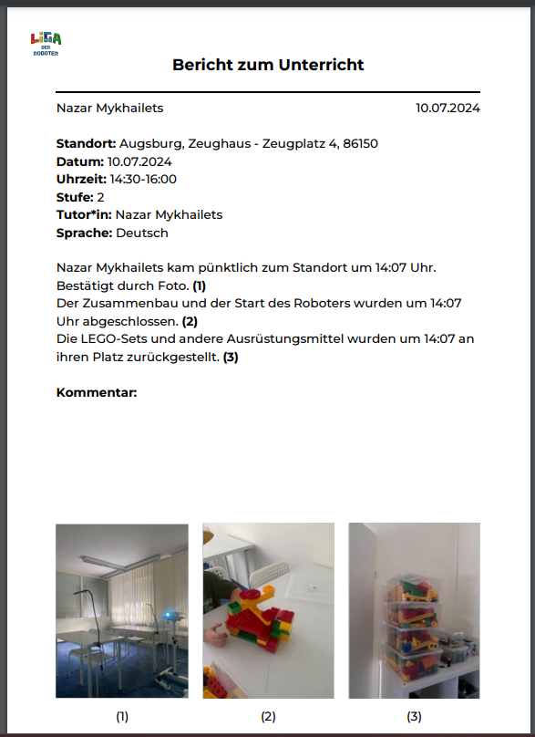
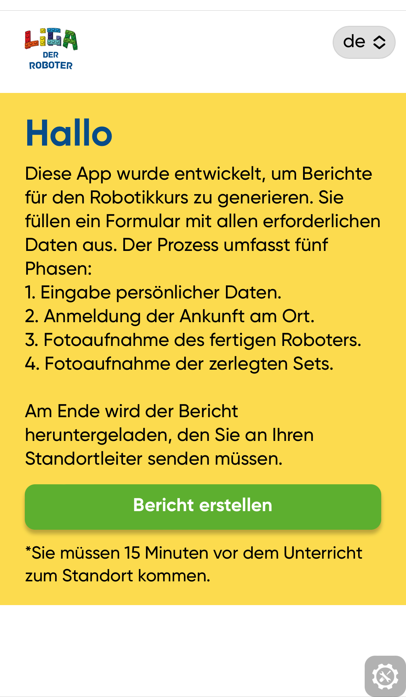
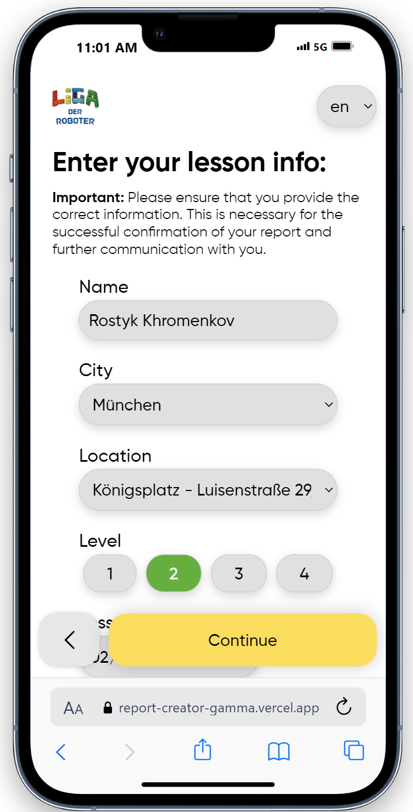
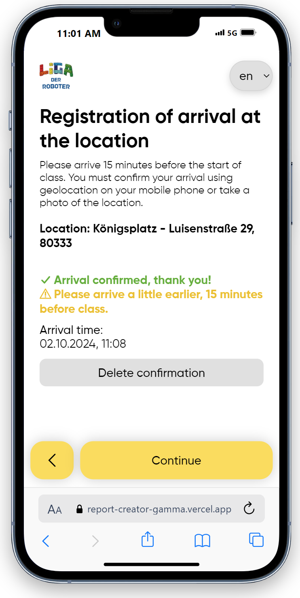
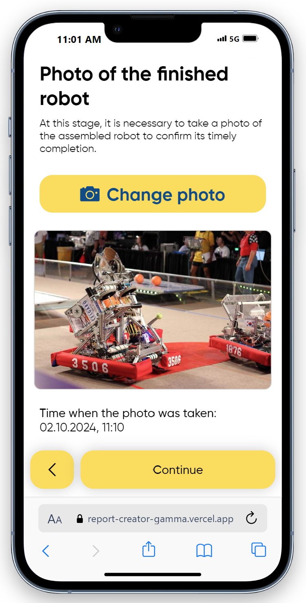
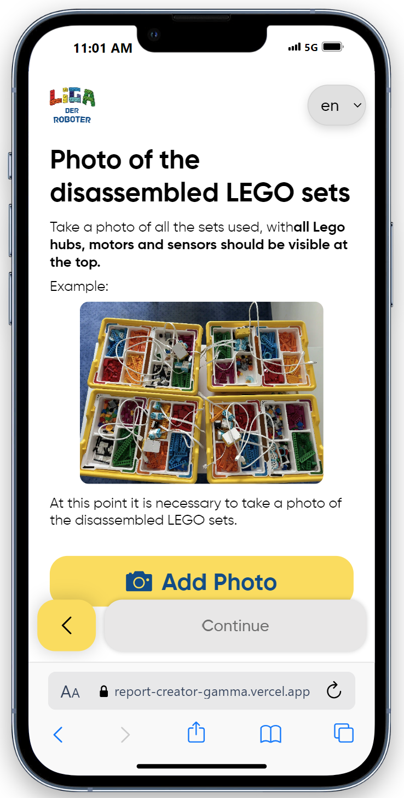
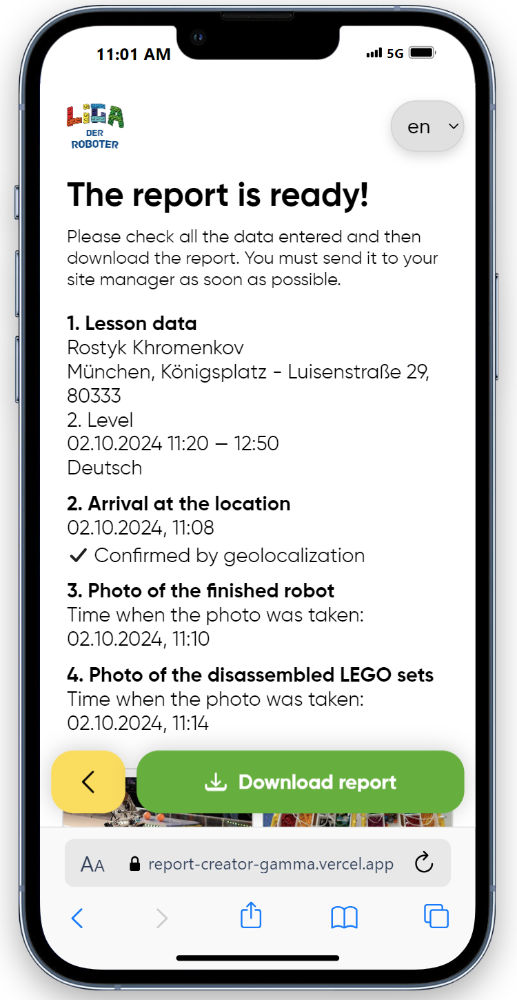
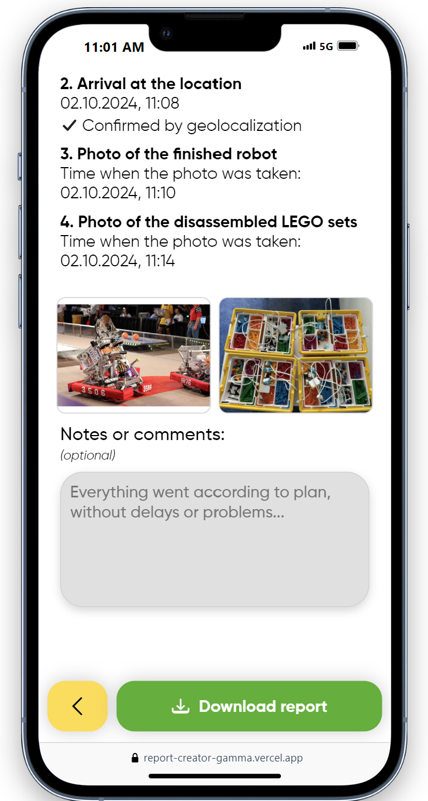

# Report_Creator_Public_Showcase
Report Creator is a web application designed to help *Liga der Roboter* teachers quickly create PDF reports about their classes.
The application supports most spoken languages in the company: German, English, and Russian.
The report contains:
- Teacher name
- General information about the class (location, date, time, class level).
- Information about teacher's arrival. It requires taking a photo OR completing a location check (checks whether teacher's position is near the location's position).
- Information about when the teacher started the class.
- Information about when the teacher ended the class

## Example of a report (pdf)

## Screenshots

<table>
  <tr>
    <td>
      
    </td>
    <td>
      
    </td>
  </tr>
  <tr>
    <td>
      
    </td>
    <td>
      
    </td>
  </tr>
  <tr>
    <td>
      
    </td>
    <td>
      
    </td>
    <td>
      
    </td>
  </tr>
</table>
